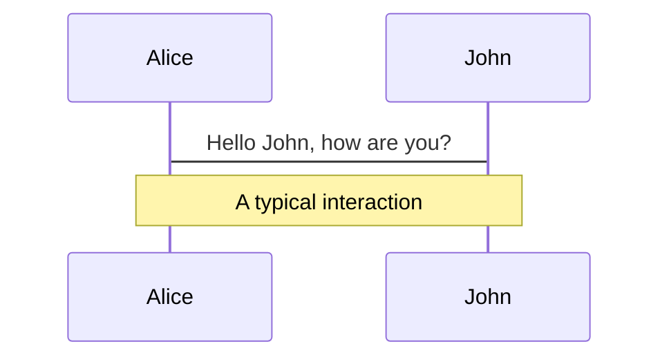
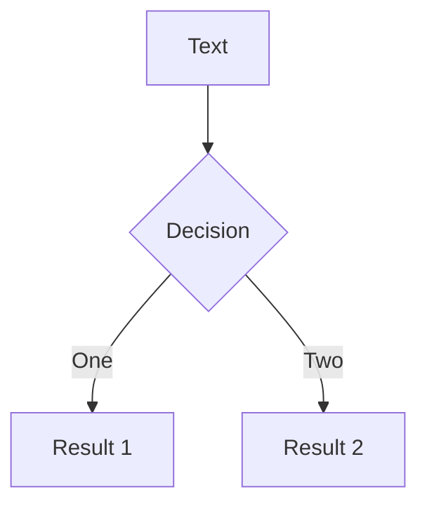
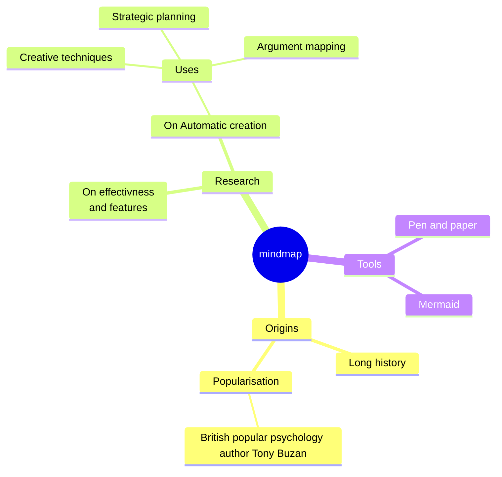
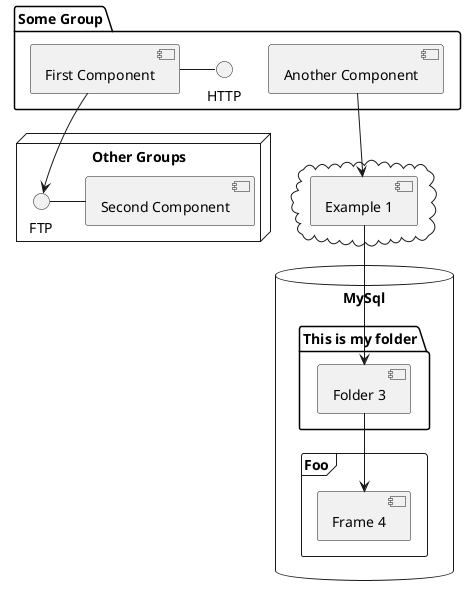

# 移库位

业务流程以及在PDA上的实现

<!--
The last comment block of each slide will be treated as slide notes. It will be visible and editable in Presenter Mode along with the slide. [Read more in the docs](https://sli.dev/guide/syntax.html#notes)
-->

---
transition: slide-left
layout: image-left
image: /images/location2.jpeg
title: 基本概念
---

# 基本概念

<br>

- **库位**：存放货物的地方，通常是一个有固定位置的区域。库位可以是一个房间、一个区域或一个货架。

- **托盘**：托盘是一个用于存放物品的平台，通常由木材、塑料或金属制成。它具有一定的尺寸和承重能力，可以方便地堆放和搬运物品。

- **SKU**：库存单元(Stock Keeping Unit)。它是一个唯一的标识符，用于区分和追踪库存中的不同物品。

<br>
<br>


<!--
You can have `style` tag in markdown to override the style for the current page.
Learn more: https://sli.dev/guide/syntax#embedded-styles
-->

<style>
h1 {
  background-color: #2B90B6;
  background-image: linear-gradient(45deg, #4EC5D4 10%, #146b8c 20%);
  background-size: 100%;
  -webkit-background-clip: text;
  -moz-background-clip: text;
  -webkit-text-fill-color: transparent;
  -moz-text-fill-color: transparent;
}
</style>

<!--
Here is another comment.
-->


---
transition: slide-up
layout: two-cols-customer
leftSpan: 1
rightSpan: 2
---
<!--  -->

<div class="h-full flex items-center justify-center">
<Phone img="/images/pda_moving_location.jpg" />
</div>

::right::

<div class="py-8 px-4" v-click >

</div>

---
transition: slide-up
layout: two-cols-customer
leftSpan: 1
rightSpan: 2
---
<!--  -->

<div class="h-full flex items-center justify-center">
<Phone img="/images/pda_moving_location.jpg" />
</div>

::right::

<div class="py-8 px-4 flex justify-center" >
  
</div>


---
layout: two-cols-customer
leftSpan: 1
rightSpan: 2
---

<div class="h-full flex items-center justify-center">
<Phone img="/images/pda_moving_location.jpg" />
</div>

::right::

<div class="h-full flex items-center pl-4">
  

  <div v-click class="error-list__item absolute top-15 left-45" >需查询两个接口</div>
  <arrow v-click x1="300" y1="110" x2="300" y2="245" color="#ff758e" width="3" arrowSize="1" />
  <div v-after class="error-list__item absolute top-65 left-45">数据结构不同</div>
  <arrow v-click x1="300" y1="315" x2="300" y2="430" color="#ff758e" width="3" arrowSize="1" />
  <div v-after class="error-list__item absolute top-112 left-45" >提交接口及其参数不同</div>
</div>

<style>
.error-list__item {
  padding: 0.5rem;
  color: #ff758e;
  /* border: 2px solid #ff758e;
  border-radius: 0.5rem; */
  width: 15rem;
  text-align: center;
}
</style>

---
layout: image-right
image: https://source.unsplash.com/collection/94734566/1920x1080
---

# Code

Use code snippets and get the highlighting directly![^1]

```ts {all|2|1-6|9|all}
interface User {
  id: number
  firstName: string
  lastName: string
  role: string
}

function updateUser(id: number, update: User) {
  const user = getUser(id)
  const newUser = { ...user, ...update }
  saveUser(id, newUser)
}
```

<arrow v-click="3" x1="400" y1="420" x2="230" y2="330" color="#564" width="3" arrowSize="1" />

[^1]: [Learn More](https://sli.dev/guide/syntax.html#line-highlighting)

<style>
.footnotes-sep {
  @apply mt-20 opacity-10;
}
.footnotes {
  @apply text-sm opacity-75;
}
.footnote-backref {
  display: none;
}
</style>


---

# Diagrams

You can create diagrams / graphs from textual descriptions, directly in your Markdown.

<div class="grid grid-cols-4 gap-5 pt-4 -mb-6">









</div>

[Learn More](https://sli.dev/guide/syntax.html#diagrams)

---
src: ./pages/multiple-entries.md
hide: false
---

---
layout: center
class: text-center
---

# Learn More

[Documentations](https://sli.dev) · [GitHub](https://github.com/slidevjs/slidev) · [Showcases](https://sli.dev/showcases.html)
